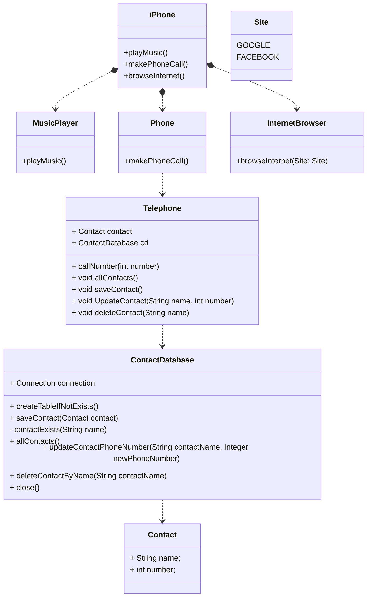

<h1>OOP Challenge</h1>

<h2>challenge posed by: https://github.com/glysns in a course of DIO. Database connection via jdbc was used.</h2>

Modeling and diagramming of the representation in UML and Code with regard to the iPhone component.

Based on the iPhone launch video as per the link below, create the class and interface diagram using a UML
        tool of your preference to represent the roles of the iPhone as: Music Player, Phone Device, and Internet
        Browser. Then, create the classes and interfaces in .java file format.

iPhone 2007 Launch

Relevant minutes from 00:15 to 00:55

<h2>Expected Behaviors:</h2>
<ul>
    <li>Music Player: play, pause, selectMusic</li>
    <li>Phone Device: dial, answer, startVoicemail</li>
    <li>Internet Browser: displayPage, addNewTab, updatePage</li>
</ul>

